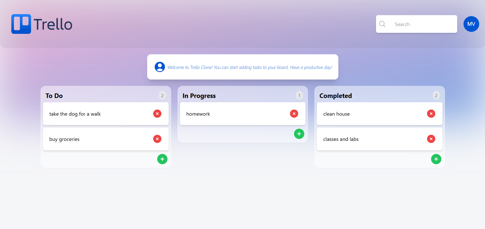
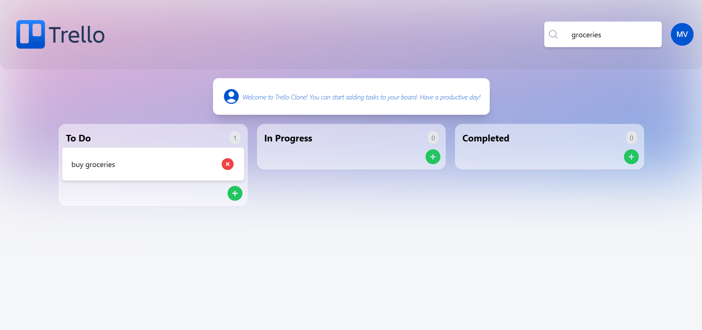

# 🗂️ Trello Clone

A full-stack Kanban-style task management app inspired by Trello. Built with **Next.js** and **Appwrite**.

## 🚀 Features

- Create boards, lists, and cards.
- Drag-and-drop cards between columns.
- Real-time data sync via Appwrite.
- User-friendly and responsive UI.

## 🛠️ Tech Stack

- Next.js (App Router)
- Tailwind CSS
- Appwrite (Database, Authentication)

## 📦 Setup

```bash
git clone https://github.com/malhardv/clone-Trello
cd clone-Trello
npm run dev


## 📸 Screenshots

### Home Page


### Features


